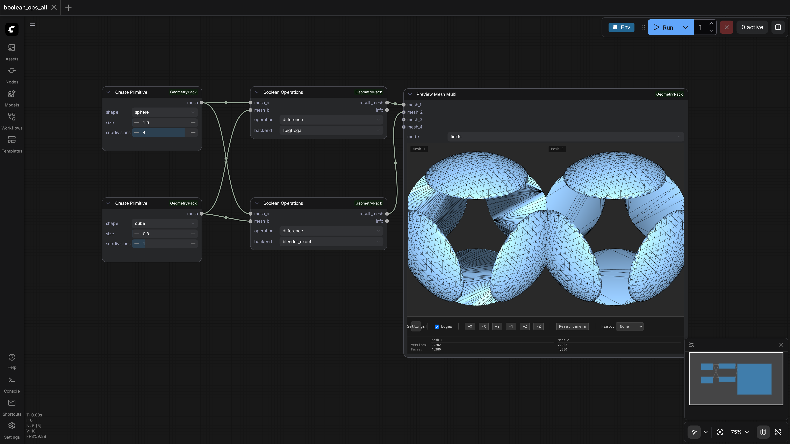
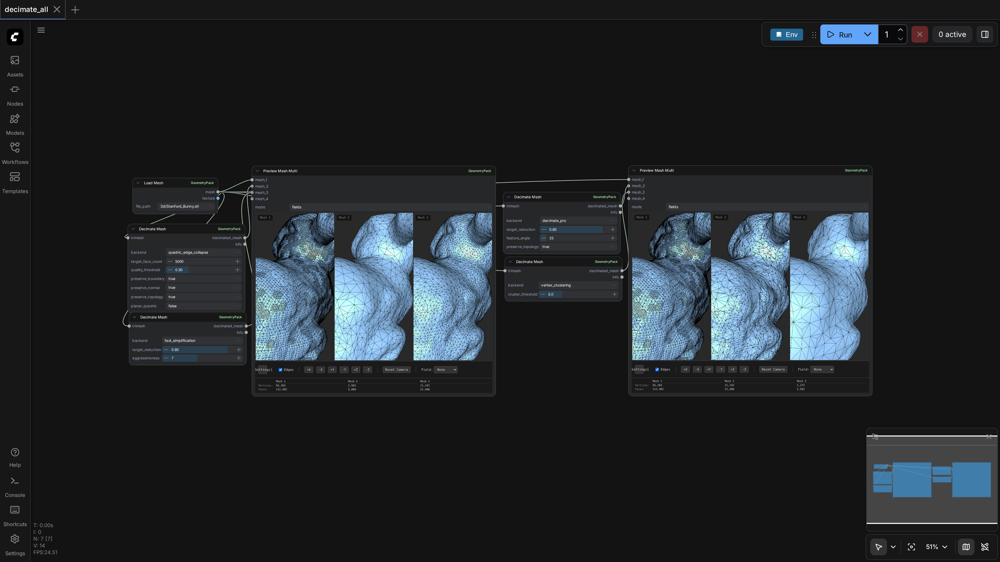
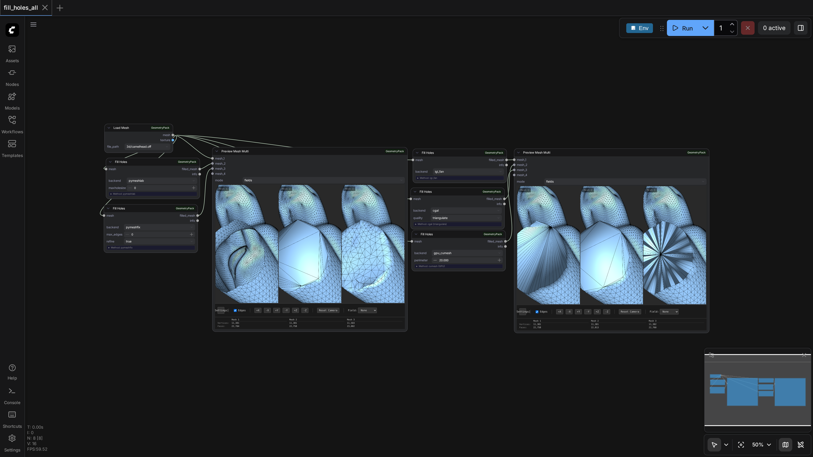
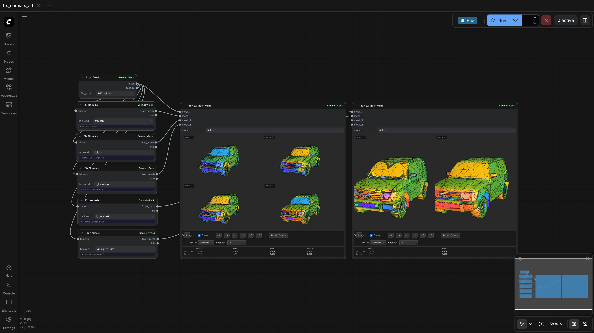
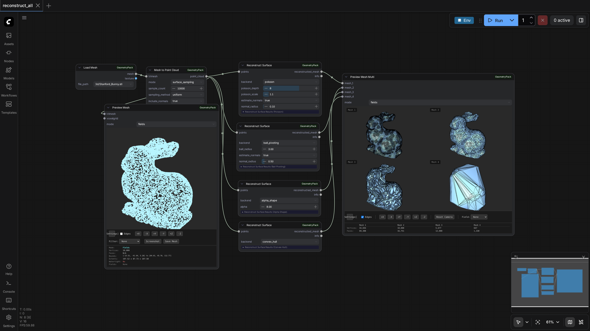
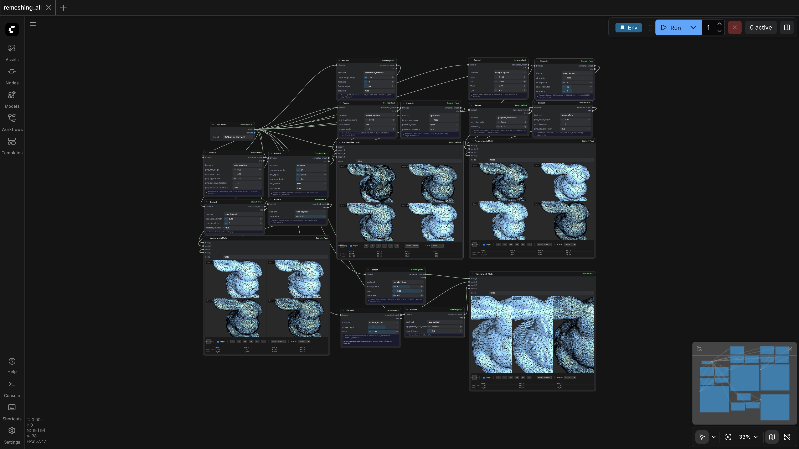
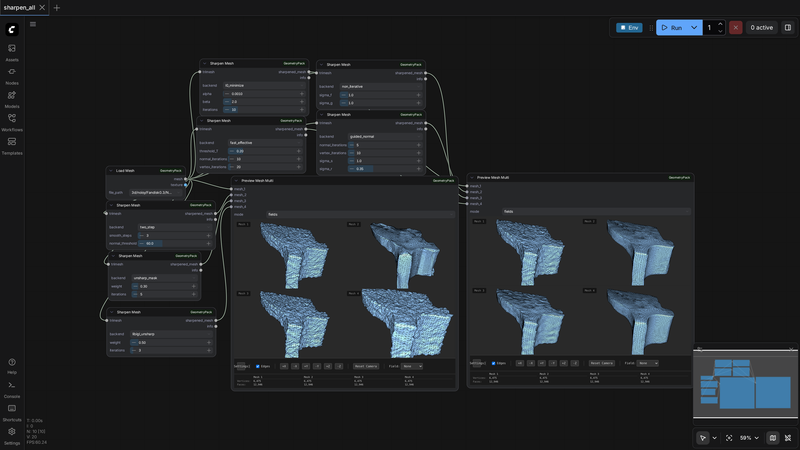
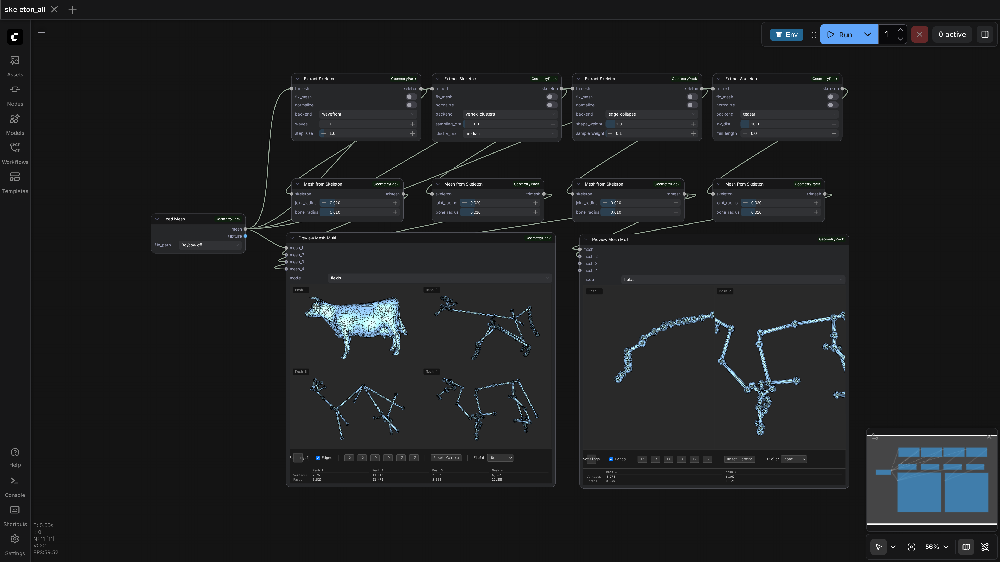
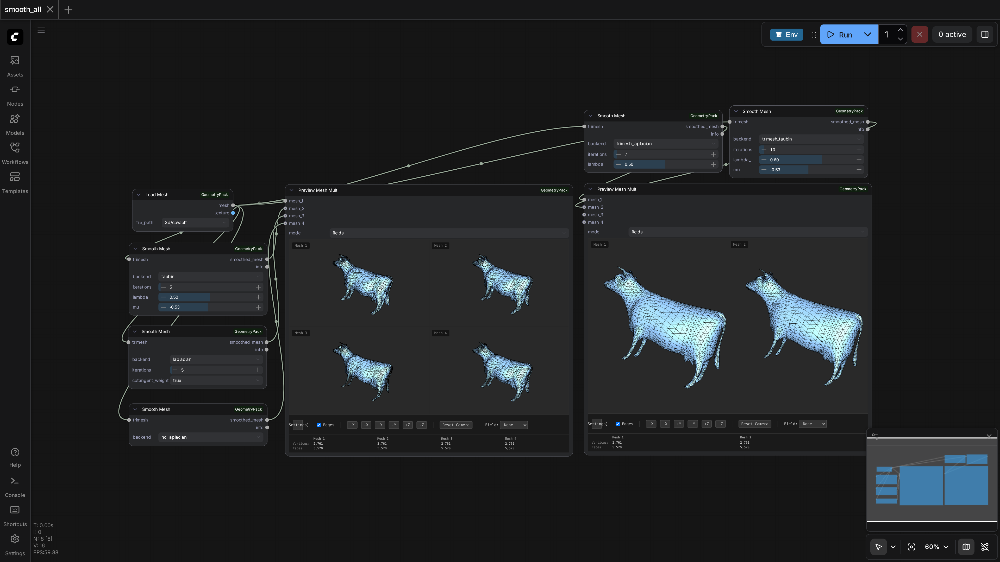
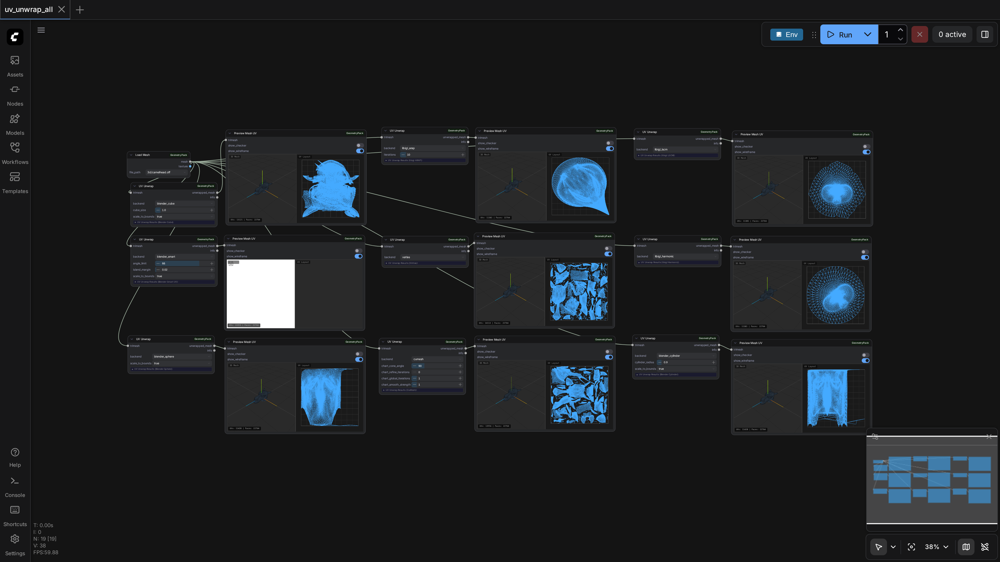

# ComfyUI-GeometryPack

## Installation

Three options, in order of speed → reliability:

1. **ComfyUI Manager (nightly, recommended)** — search for `ComfyUI-GeometryPack` in the Manager and click Install **from the nightly version**. Do **NOT** use any numbered version like `0.2.4` — they are outdated.
2. **Manager via Git URL** — in ComfyUI Manager: "Install via Git URL" with `https://github.com/PozzettiAndrea/ComfyUI-GeometryPack.git`.
3. **Manual (most reliable)**:
   ```bash
   cd ComfyUI/custom_nodes
   git clone https://github.com/PozzettiAndrea/ComfyUI-GeometryPack.git
   cd ComfyUI-GeometryPack
   pip install -r requirements.txt --upgrade
   python install.py
   ```

> **Please report any problems** you hit during installation or use of my nodes — open a [Discussion](https://github.com/PozzettiAndrea/ComfyUI-GeometryPack/discussions) or [Issue](https://github.com/PozzettiAndrea/ComfyUI-GeometryPack/issues). Very grateful for your help! 🙏

---


Professional geometry processing nodes for ComfyUI. Load, analyze, remesh, unwrap, and visualize 3D meshes directly in your workflows.

<div align="center">
<a href="https://pozzettiandrea.github.io/ComfyUI-GeometryPack/">

</a>
<br>
<b><a href="https://pozzettiandrea.github.io/ComfyUI-GeometryPack/">View Live Test Gallery →</a></b>
</div>


## Some previews

https://github.com/user-attachments/assets/c2e393ba-fb57-4a46-b772-31c4b01f47f8


https://github.com/user-attachments/assets/b1bcd570-719f-4be5-868d-f72c9f1f4c10


https://github.com/user-attachments/assets/607e6b29-a8d4-4346-873a-5bd6b140bdba


https://github.com/user-attachments/assets/7718a5d7-cd5b-47d3-874c-29ada4320694

## Community

Questions or feature requests? Open a [Discussion](https://github.com/PozzettiAndrea/ComfyUI-GeometryPack/discussions) on GitHub.

Join the [Comfy3D Discord](https://discord.gg/bcdQCUjnHE) for help, updates, and chat about 3D workflows in ComfyUI.

## Multi-Backend Nodes

Each of these nodes presents a single UI with a backend selector dropdown. Under the hood, ComfyUI's GraphBuilder dispatches to hidden backend-specific nodes, enabling cross-environment execution (main, Blender, GPU, CGAL).

| Node | Backends |
|------|----------|
| **Remesh** | pymeshlab_isotropic, instant_meshes, quadriflow, mmg_adaptive, geogram_smooth, geogram_anisotropic, pmp_uniform, pmp_adaptive, quadwild, cgal_isotropic, blender_voxel, blender_smooth, blender_sharp, blender_blocks, gpu_cumesh |
| **Decimate Mesh** | quadric_edge_collapse, fast_simplification, vertex_clustering, cgal_edge_collapse, decimate_pro |
| **Fill Holes** | trimesh, pymeshlab, pymeshfix, igl_fan, cgal, gpu_cumesh |
| **Smooth Mesh** | taubin, laplacian, hc_laplacian, trimesh_laplacian, trimesh_taubin |
| **Sharpen Mesh** | two_step, unsharp_mask, libigl_unsharp, l0_minimize, guided_normal, vsa_snap, fast_effective, non_iterative |
| **Fix Normals** | trimesh, igl_bfs, igl_winding, igl_raycast, igl_signed_dist |
| **Reconstruct Surface** | poisson, ball_pivoting, alpha_shape, convex_hull, delaunay_2d, alpha_wrap (CGAL) |
| **UV Unwrap** | xatlas, cumesh (GPU), libigl_lscm, libigl_harmonic, libigl_arap, blender_smart, blender_cube, blender_cylinder, blender_sphere |
| **Extract Skeleton** | wavefront, vertex_clusters, edge_collapse, teasar |
| **Boolean** | libigl_cgal, blender_exact |

## Workflow Screenshots

### Boolean Operations


### Decimation


### Fill Holes


### Fix Normals


### Surface Reconstruction


### Remeshing


### Sharpening


### Skeleton Extraction


### Smoothing


### UV Unwrap


## License

**GNU General Public License v3.0 or later (GPL-3.0-or-later)**

This project is licensed under the GPL-3.0-or-later license to ensure compatibility with the included dependencies:

- **Blender** (GPL-2.0-or-later) - Used for advanced UV unwrapping and remeshing
- **CGAL** (GPL-3.0-or-later) - Used for boolean operations and isotropic remeshing
- **PyMeshLab** (GPL-3.0) - Used for mesh processing operations

### What This Means

- ✅ You can use, modify, and distribute this software freely
- ✅ You can use it for commercial purposes
- ⚠️ If you distribute modified versions, you must also license them under GPL-3.0-or-later
- ⚠️ You must share the source code of any modifications you distribute

For more details, see:
- [LICENSE](LICENSE) - Full GPL-3.0 license text
- [THIRD-PARTY-NOTICES.md](THIRD-PARTY-NOTICES.md) - Detailed third-party license information

### Questions?

If you have questions about licensing, please open an issue on [GitHub](https://github.com/PozzettiAndrea/ComfyUI-GeometryPack/issues).
